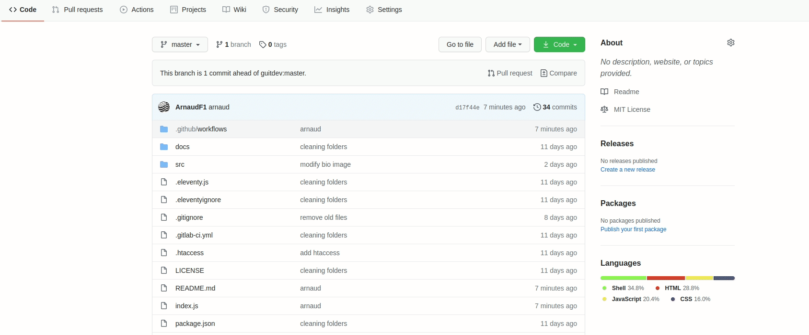

# Deploy to OVHcloud web hosting

Deploy your repository content to an OVHcloud Web Hosting plan with SSH support.

With the OVHcloud Actions for GitHub, you can automate your workflow to deploy OVHcloud Web hostings using GitHub Actions.

## Getting started

Get started today with a free trial of our Web PaaS "POWER" !

[](https://www.ovh.com/ie/order/express/#/express/review?products=~(~(productId~%27powerHosting~planCode~%27powerBeta1~duration~%27P12M~configuration~(~(label~%27language~value~%27python)))))

[](https://www.ovh.com/ie/order/express/#/express/review?products=~(~(productId~%27powerHosting~planCode~%27powerBeta1~duration~%27P12M~configuration~(~(label~%27language~value~%27ruby)))))

[](https://www.ovh.com/ie/order/express/#/express/review?products=~(~(productId~%27powerHosting~planCode~%27powerBeta1~duration~%27P12M~configuration~(~(label~%27language~value~%27nodejs)))))


## Add a GitHub Action

Add a deployment action []${GITHUB_SERVER_URL}/${GITHUB_REPOSITORY}(new/main?filename=.github%2Fworkflows%2Fovhcloud-deploy.yml)

Copy and paste the following snippet into your .yml file :

	name: Deploy to OVHcloud Power

	on:
	  push:
	    branches: [ master ]
	  
	  workflow_dispatch:

	jobs:
	  deploy:    
	    runs-on: ubuntu-20.04

	    steps:
	      - name: Install prerequisites
	        run: |
	          sudo apt-get update
	          sudo apt-get install -y curl jq sshpass openssh-client

	      - name: WakeUp website
	        env:
	            OVH_WEBSITE_URL: ${{ secrets.OVH_WEBSITE_URL }}
	        run: curl --silent --insecure --location --write-out "%{http_code}" -o /dev/null ${OVH_WEBSITE_URL}

	      - name: Clone over SSH
	        env:
	            OVH_SSH_HOST: ${{ secrets.OVH_SSH_HOST }}
	            OVH_SSH_PORT: ${{ secrets.OVH_SSH_PORT }}
	            OVH_SSH_USERNAME: ${{ secrets.OVH_SSH_USERNAME }}
	            OVH_SSH_PASSWORD: ${{ secrets.OVH_SSH_PASSWORD }}
	        run: sshpass -p ${OVH_SSH_PASSWORD} ssh -oStrictHostKeyChecking=no -oUserKnownHostsFile=/dev/null -oLogLevel=quiet ${OVH_SSH_USERNAME}@${OVH_SSH_HOST} -p ${OVH_SSH_PORT} -- 'rm -rf ${HOME} && git clone '${GITHUB_SERVER_URL}'/'${GITHUB_REPOSITORY}'.git --single-branch --branch '${GITHUB_REF##*/}' ${HOME}'

	      - name: WakeUp website
	        env:
	            OVH_WEBSITE_URL: ${{ secrets.OVH_WEBSITE_URL }}
	        run: curl --silent --fail --insecure --location --write-out "%{http_code}" -o /dev/null ${OVH_WEBSITE_URL}


## Add your Github Secrets

Create several secrets in your repository:

```OVH_SSH_HOST``` : SSH hostname related to your OVHCloud Power hosting (Ex: ssh.clusterXXX.hosting.ovh.net. You can get the info here: https://www.ovh.com/manager/web/#)

```OVH_SSH_PORT``` : SSH hostname port related to your OVHCloud Power hosting (Ex: 22)

```OVH_SSH_USERNAME``` : SSH username related to your OVHCloud Power hosting (Ex: myusername, more info here: https://docs.ovh.com/gb/en/hosting/web_hosting_ssh_on_web_hosting_packages/) 

```OVH_SSH_PASSWORD``` : SSH username password related to your Power hosting (Ex: myverycomplexpassword)

```OVH_WEBSITE_URL``` : HTTP URL of your OVHCloud Power hosting (Ex: http://mybeautifuldomain.ovh)

```OVH_WEBSITE_DOCUMENTROOT``` : Documentroot related to your OVHCloud Power hosting (Ex: www)

```OVH_WEBSITE_ENTRYPOINT``` : entrypoint related to your OVHCloud Power hosting (Ex: app.py)

```OVH_WEBSITE_PUBLICDIR``` : public directory related to your OVHCloud Power hosting (Ex: public)



## Run workflow


## It's Done !

Go to ```OVH_WEBSITE_URL``` 